# UNCT User Guide

This is the same content shown in-app (Settings → **Open the User Guide**), kept here as a
standalone file so it travels with Release artifacts. English first, فارسی below.

---

## English

### What is UNCT?

UNCT (Universal Network Config Toolkit) turns proxy/VPN configs — VLESS, VMess, Trojan,
Shadowsocks, Hysteria2, TUIC, and WireGuard links or subscription files — into a single readable
model, then lets you inspect, convert, and export them. Built for anyone managing a handful of
configs or a few thousand: no account, no install, no server.

**100% offline, by design.** Every parse, analysis, and export happens entirely in your browser
tab. Nothing you paste or import is ever sent to a server — there isn't one. That's not a privacy
promise, it's the architecture: UNCT has no backend to send data to.

### First time here? Do this

1. **Paste a config** — Open **Converter**, paste a config link (or a whole subscription) into
   the box, and press **Parse**.
2. **Look it over** — Open **Analyzer** for a security/compatibility breakdown of one node, or
   **Subscription Center** to search, filter, and manage the whole list.
3. **Export what you need** — Open **Export Center** and pick a format — plain links, Clash,
   Sing-box, Xray, QR codes, and more.

### The 8 screens

#### Dashboard
An at-a-glance summary: how many nodes you have, their health/warnings, and your most recent
imports and exports. Open this first after importing a config, or any time you want the big
picture.

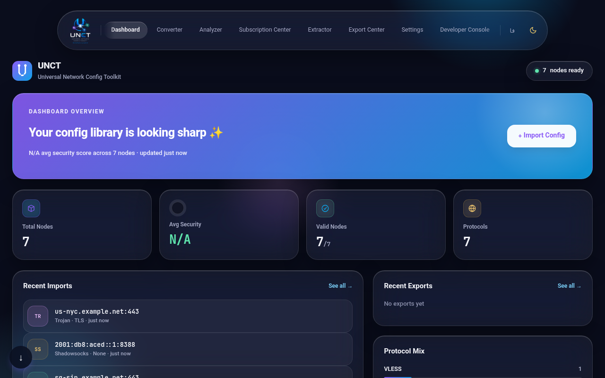

#### Converter
Where configs come in. Paste text, upload a file, drag a file onto the page, or paste from the
clipboard — UNCT detects the format automatically and parses it. Every session starts here — this
is the only way nodes enter UNCT.

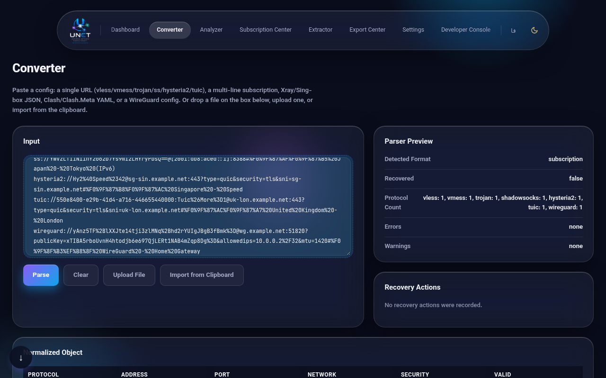

#### Analyzer
A deep breakdown of a single node: protocol details, TLS/Reality settings, compatibility and risk
scores, Cloudflare/Clean-IP checks, and more. Use this when you need to judge whether one specific
node is trustworthy or correctly configured.

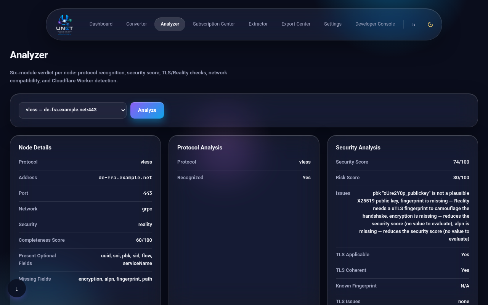

#### Subscription Center
The full node list: search, filter, sort, group, deduplicate, tag, test latency/port availability,
and build new subscription links from templates. Use this to manage many nodes at once — cleaning
up, organizing, or combining lists.

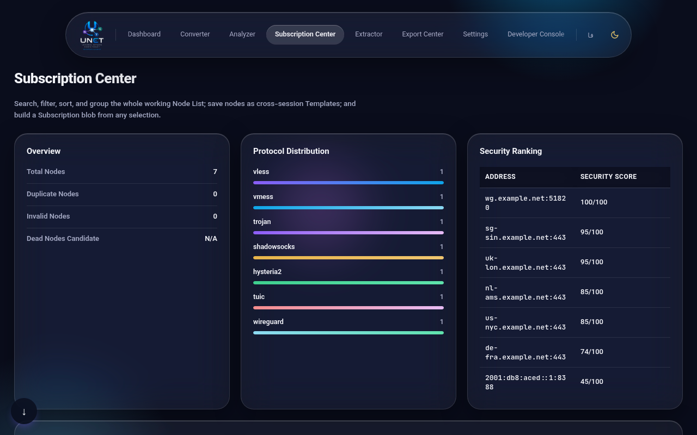

#### Extractor
Pulls out one specific field across every node at once — UUIDs, IPs, domains, Reality keys,
credentials, transport settings, and more. Use this when you need one kind of value (e.g. every
UUID) copied out in bulk, not the full config.

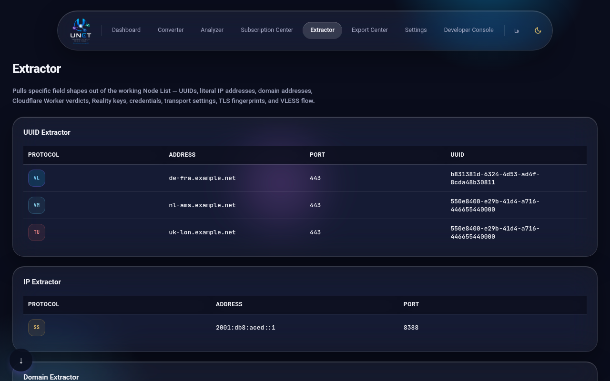

#### Export Center
Turns your node list into a file or format you can use elsewhere: plain links, Clash YAML,
Sing-box or Xray JSON, CSV, QR codes, a PDF/HTML report, or a full portable backup. Use this once
you're happy with the list and ready to hand it to another app or device.

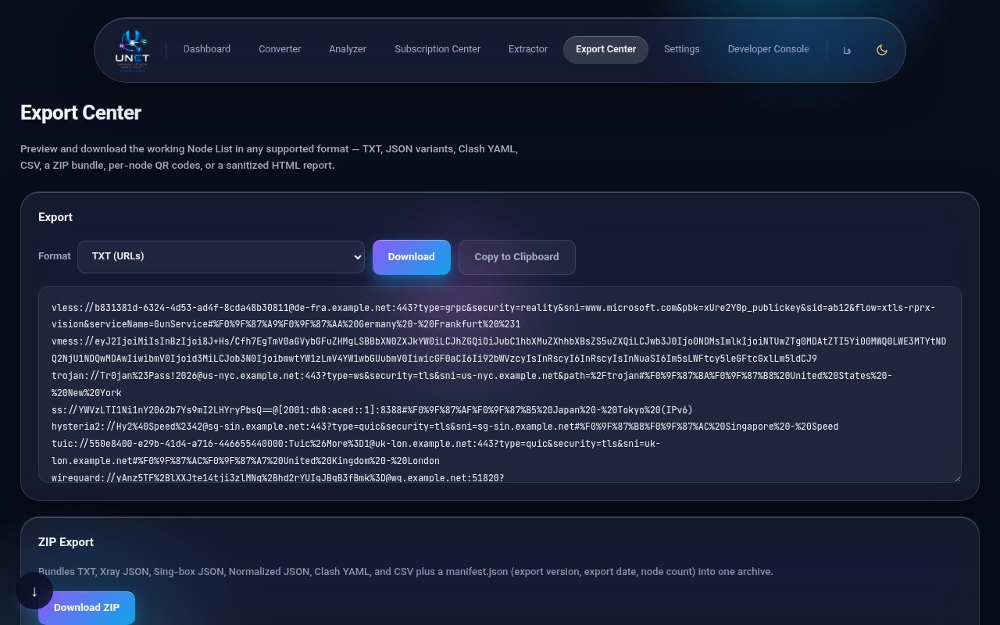

#### Settings
Theme, language, and three toggles that shape how parsing behaves — Strict Validation (flags
questionable nodes instead of silently accepting them), Auto-repair (fixes broken configs
automatically), and Deduplicate on import (skips nodes you already have) — plus a full data wipe.
Use this to adjust behavior, switch to فارسی, or clear everything and start fresh. This guide lives
here too.

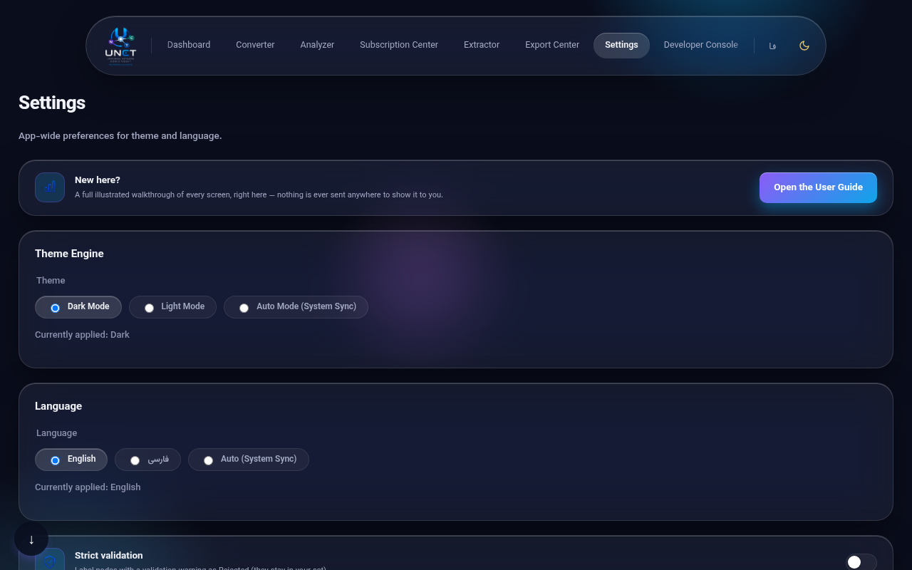

#### Developer Console
Raw logs: what each parser tried, what got recovered or rejected, timing, and which alternative
format guesses lost to the winning one. Use this when something looks wrong and you need to see
exactly what UNCT did, step by step.

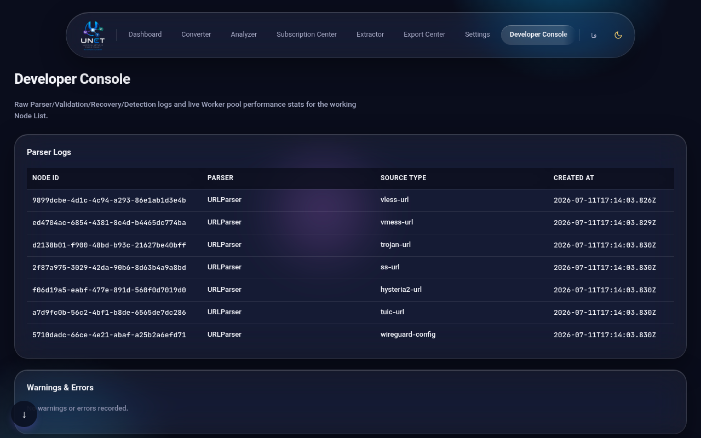

### Known limits — read before you rely on this

We want to be honest with you about where this tool falls short.

- **Very large imports**: a real ~5000-6000-node import once crashed the tab, before Subscription
  Center's node list was rebuilt to only render what's on screen. That rebuild is
  regression-tested up to 3000 nodes without issue; it isn't a certified guarantee at 5000-6000,
  just a real fix for a real incident.
- **Supported inputs**: VLESS, VMess, Trojan, Shadowsocks, Hysteria2, TUIC, and WireGuard links or
  config files, plus Clash/Clash.Meta, Sing-box, and Xray configs and subscription files.
  **Supported exports**: plain links, Clash YAML, Sing-box JSON, Xray JSON, Normalized/Analysis
  JSON, CSV, PDF, Excel, Markdown, ZIP, QR codes, and an HTML report.
- **Visualization**: UNCT doesn't draw diagrams showing how servers relate to each other or map
  your network's shape — that data is never stored. The one chart you do get is the protocol
  breakdown in Subscription Center.

---

## فارسی

### UNCT چیست؟

UNCT کانفیگ‌های پراکسی و VPN شما را — لینک‌های VLESS، VMess، Trojan، Shadowsocks، Hysteria2،
TUIC، WireGuard، یا یک فایل Subscription کامل — می‌گیرد و به یک مدل واحد و قابل‌فهم تبدیل
می‌کند؛ بعد می‌توانید همان‌جا بررسی‌شان کنید، به فرمت دیگری تبدیل‌شان کنید، یا خروجی بگیرید. چه
چند کانفیگ داشته باشید چه چند هزارتا، برایتان کار می‌کند — بدون حساب کاربری، بدون نصب، بدون
سرور.

**۱۰۰٪ آفلاین، از پایه‌ی طراحی.** هر Parse، تحلیل و خروجی‌گیری کاملاً همین‌جا، همین تب
مرورگرتان، انجام می‌شود. هرچه Paste یا Import کنید هیچ‌وقت به هیچ سروری فرستاده نمی‌شود — چون
اصلاً سروری در کار نیست. این فقط یک قول درباره‌ی حریم‌خصوصی نیست؛ خود معماری برنامه همین است:
UNCT اصلاً Backend‌ای ندارد که داده‌ای به آن بفرستد.

### اولین بار اینجایید؟ این کار را بکنید

۱. **یک کانفیگ Paste کنید** — صفحه‌ی «مبدل» را باز کنید، لینک کانفیگ‌تان (یا یک Subscription
   کامل) را در کادر Paste کنید و روی «Parse» بزنید.
۲. **مرورش کنید** — برای بررسی امنیتی و سازگاری یک نود، «تحلیل‌گر» را باز کنید؛ برای جست‌وجو،
   فیلتر و مدیریت کل فهرست، سراغ «مرکز اشتراک» بروید.
۳. **آنچه لازم دارید را خروجی بگیرید** — «مرکز خروجی» را باز کنید و فرمت مدنظرتان را انتخاب
   کنید — لینک ساده، Clash، Sing-box، Xray، کد QR و خیلی چیزهای دیگر.

### ۸ صفحه

#### داشبورد
یک نگاه کلی به همه‌چیز: چند نود دارید، وضعیت سلامت و هشدارهایشان چیست، و آخرین Import/Export‌هایتان
کدام‌اند. بعد از هر Import، یا هر وقت دلتان خواست تصویر کلی را ببینید، اول سراغ همین‌جا بروید.

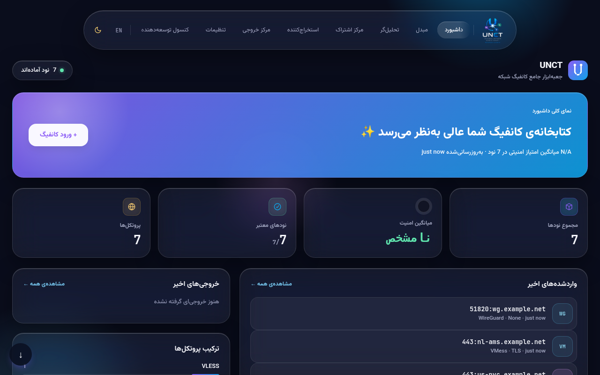

#### مبدل
همین‌جاست که کانفیگ‌ها وارد UNCT می‌شوند. متن Paste کنید، فایل Upload کنید، فایل را روی صفحه
بکشید و رها کنید، یا از Clipboard بگیرید — فرمتش را خودِ UNCT تشخیص می‌دهد و Parse می‌کند. هر بار
که کار می‌کنید، از همین‌جا شروع می‌شود — تنها دری که نودها از آن وارد UNCT می‌شوند، همین صفحه است.

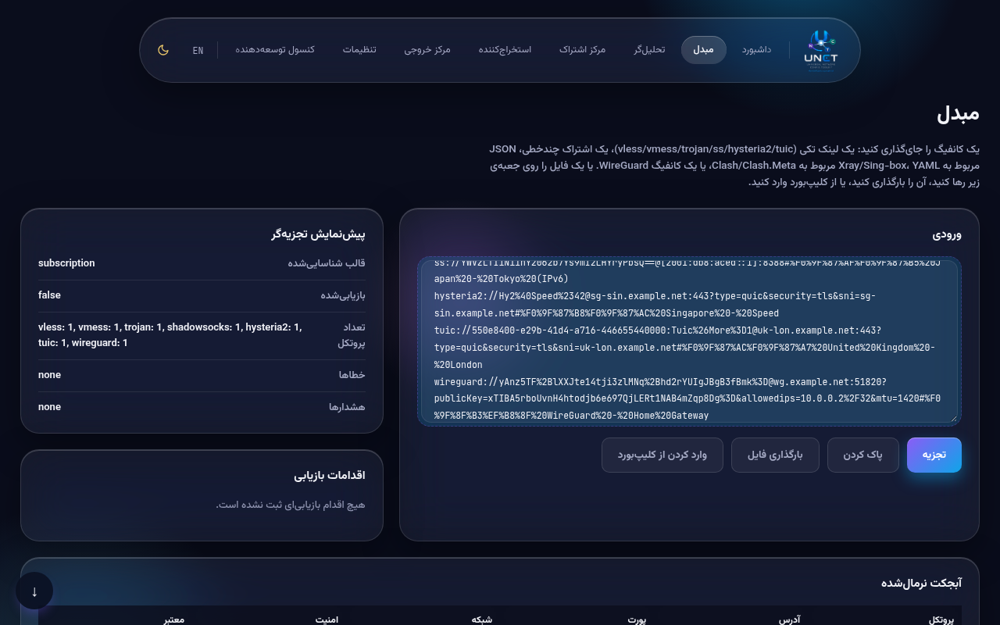

#### تحلیل‌گر
یک بررسی عمیق روی یک نود: جزئیات پروتکل، تنظیمات TLS/Reality، امتیاز سازگاری و ریسک، بررسی
Cloudflare، بررسی Clean-IP (پاک بودن IP از فهرست‌های مسدودی) و بیشتر. وقتی می‌خواهید مطمئن شوید
یک نود خاص قابل‌اعتماد است یا درست تنظیم شده، سراغ همین‌جا بروید.

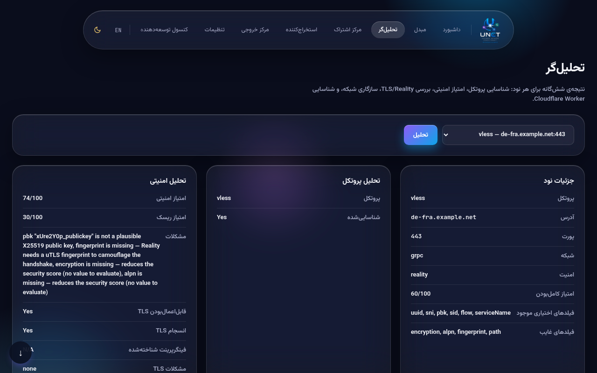

#### مرکز اشتراک
کل فهرست نودهایتان: جست‌وجو کنید، فیلتر کنید، مرتب و گروه‌بندی کنید، موارد تکراری را حذف کنید،
برچسب بزنید، Latency و Port را تست کنید، و از روی یک Template لینک Subscription تازه بسازید.
وقتی باید تعداد زیادی نود را هم‌زمان مدیریت کنید — پاکسازی، سازمان‌دهی، یا ترکیب چند فهرست —
سراغ همین‌جا بروید.

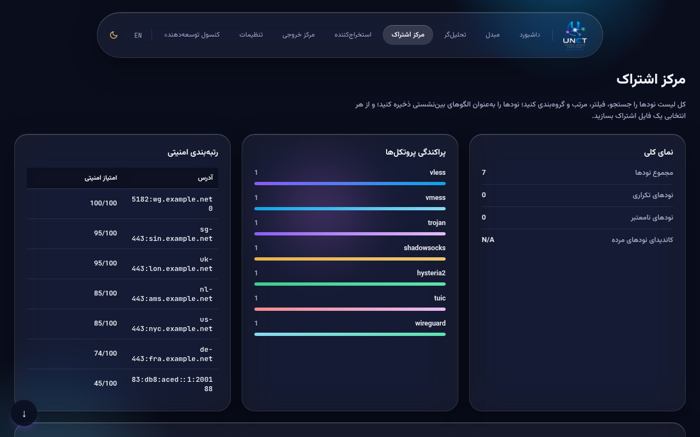

#### استخراج‌کننده
یک نوع مقدار مشخص را از همه‌ی نودها با هم بیرون می‌کشد — UUID، IP، دامنه، کلیدهای Reality،
Credentials، تنظیمات Transport و بیشتر. وقتی فقط یک نوع مقدار لازم دارید (مثلاً همه‌ی UUIDها)،
نه کل کانفیگ، آن‌هم به‌صورت گروهی، سراغ همین‌جا بروید.

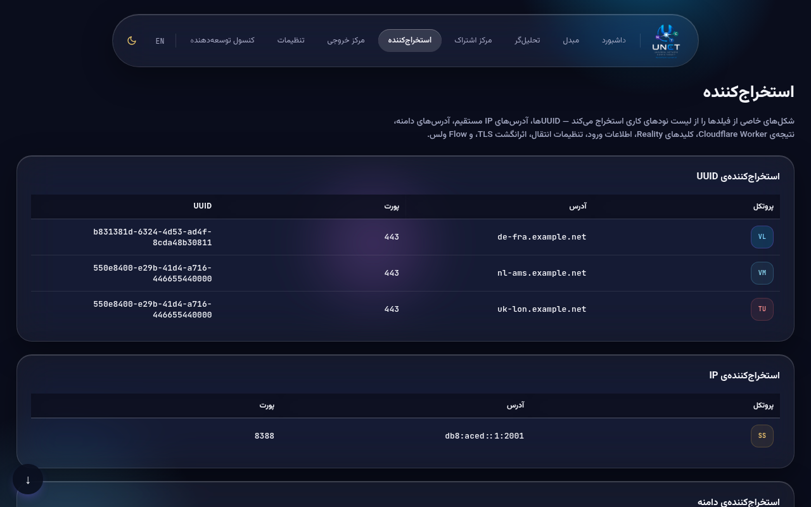

#### مرکز خروجی
فهرست نودهایتان را به فایل یا فرمتی تبدیل می‌کند که جای دیگری هم به کارتان بیاید: لینک ساده،
Clash YAML، JSON مخصوص Sing-box یا Xray، CSV، کد QR، گزارش PDF یا HTML، یا یک نسخه‌ی پشتیبان
کامل و قابل‌حمل. وقتی از فهرست‌تان راضی هستید و می‌خواهید آن را به برنامه یا دستگاه دیگری بدهید،
سراغ همین‌جا بروید.

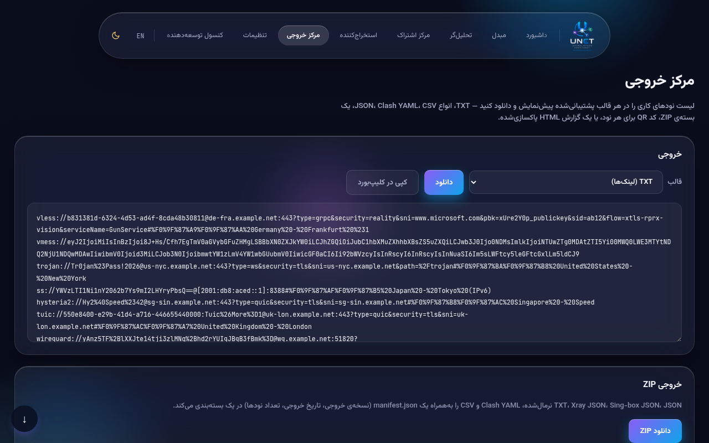

#### تنظیمات
تم، زبان، و سه توگل که رفتار Parse را شکل می‌دهند — «اعتبارسنجی سخت‌گیرانه» (نودهای مشکوک را
به‌جای پذیرفتن، برچسب می‌زند)، «تعمیر خودکار» (کانفیگ‌های خراب را خودش درست می‌کند)، و «ادغام
موارد تکراری هنگام Import» (نودهایی که از قبل دارید را نادیده می‌گیرد) — به‌علاوه‌ی پاک‌کردن
کامل داده‌ها. برای تغییر رفتار برنامه، تغییر زبان، یا پاک‌کردن همه‌چیز و شروع از نو، سراغ همین‌جا
بروید. همین راهنما هم دقیقاً همین‌جا زندگی می‌کند.

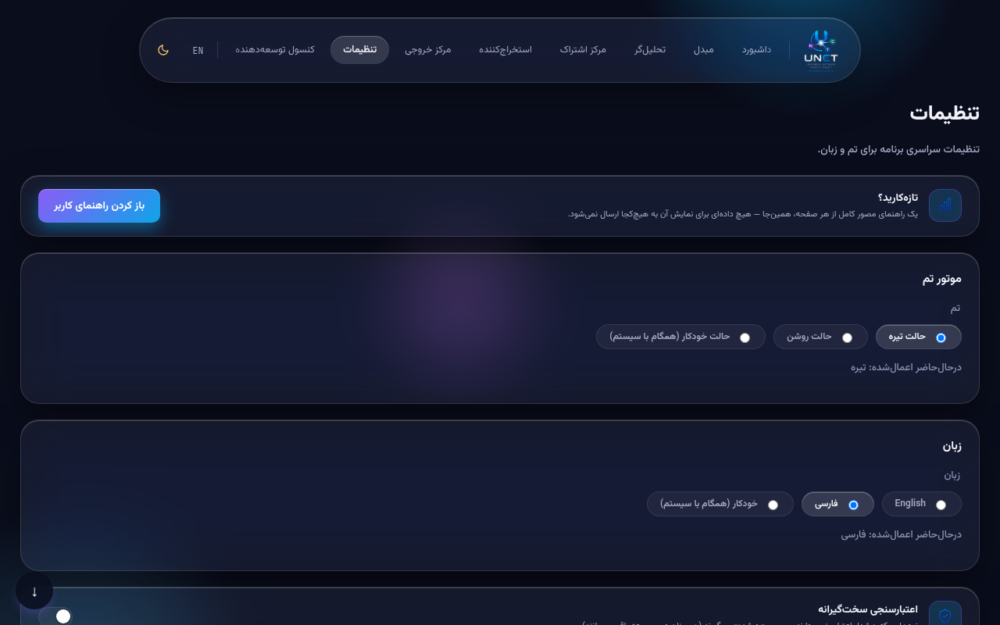

#### کنسول توسعه‌دهنده
لاگ خام و دست‌نخورده: هر Parser چه چیزی را امتحان کرد، چه چیزی بازیابی یا رد شد، چقدر طول کشید،
و کدام حدس‌های فرمت جایگزین در برابر فرمت برنده باختند. وقتی چیزی درست به‌نظر نمی‌رسد و
می‌خواهید قدم‌به‌قدم ببینید UNCT دقیقاً چه کاری کرده، سراغ همین‌جا بروید.

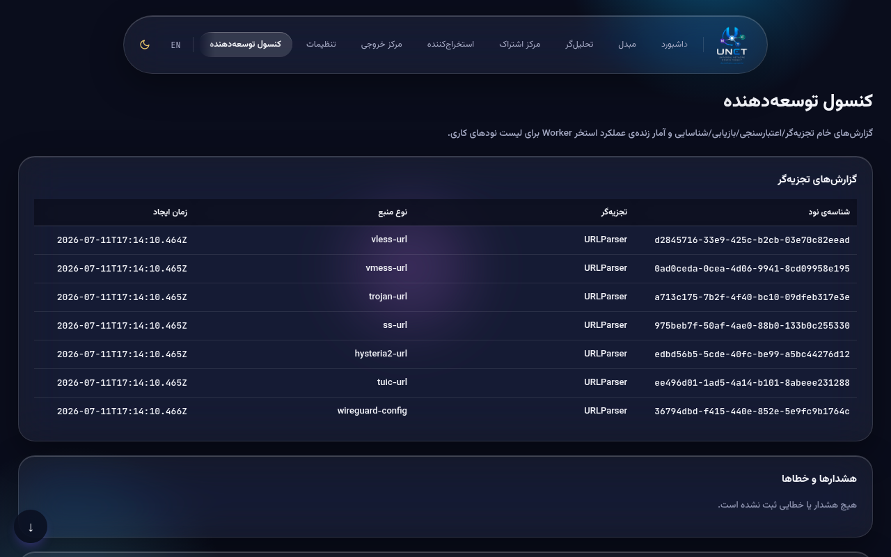

### محدودیت‌های شناخته‌شده — پیش از تکیه‌کردن رویشان بخوانید

می‌خواهیم درباره‌ی جایی که این ابزار محدود می‌شود، با شما صادق باشیم.

- **وارد کردن فهرست‌های خیلی بزرگ**: یک بار وارد کردن واقعی حدود ۵۰۰۰ تا ۶۰۰۰ نود، تب مرورگر را
  کرش داد — پیش از آنکه فهرست نود «مرکز اشتراک» بازسازی شود تا فقط همان بخشی را رندر کند که روی
  صفحه دیده می‌شود. آن بازسازی تا ۳۰۰۰ نود با تست‌های بازگشت به عقب (Regression) تأیید شده؛ این
  یک تضمین رسمی برای ۵۰۰۰ تا ۶۰۰۰ نود نیست، فقط یک رفع واقعی برای یک اتفاق واقعی است.
- **فرمت‌های ورودی پشتیبانی‌شده**: لینک‌ها یا فایل‌های کانفیگ VLESS، VMess، Trojan، Shadowsocks،
  Hysteria2، TUIC و WireGuard، به‌علاوه‌ی کانفیگ و فایل Subscription مخصوص Clash/Clash.Meta،
  Sing-box و Xray. **فرمت‌های خروجی پشتیبانی‌شده**: لینک ساده، Clash YAML، JSON مخصوص Sing-box،
  JSON مخصوص Xray، JSON نرمال‌شده/تحلیل، CSV، PDF، Excel، Markdown، ZIP، کد QR، و یک گزارش HTML.
- **Visualization**: UNCT نموداری که رابطه‌ی بین سرورها یا نقشه‌ی شبکه‌تان را نشان دهد رسم
  نمی‌کند — چون اصلاً چنین اطلاعاتی ذخیره نمی‌شود. تنها نموداری که در اختیار دارید، نمودار
  توزیع پروتکل‌ها در «مرکز اشتراک» است.
